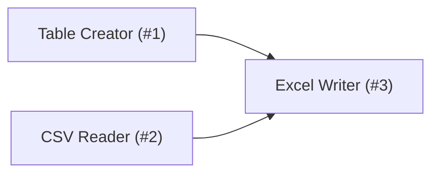

# Workflow : Simple Workflow Example

> **Auteur** : Antigravity Agent  
> **Version** : 4.7.0.v202211291246  

## Description
A sample workflow for testing CLI metadata extraction.

## Documentation (Annotations)
> Ce workflow permet de fusionner des données CSV et Table pour générer un rapport Excel.

## Diagramme de Flux

## Liste des Nœuds

- **#1** : Table Creator
- **#2** : CSV Reader
- **#3** : Excel Writer
